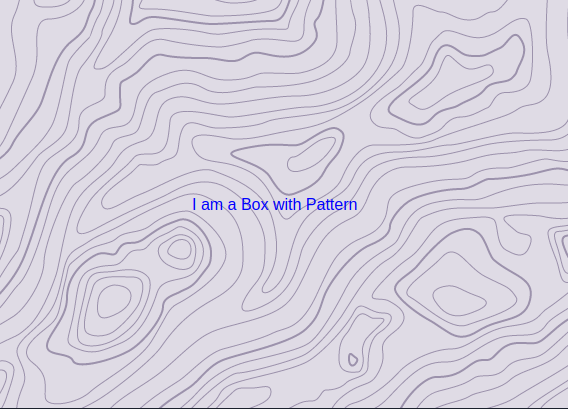

<div align="center">

  <h1>
    <br/>
    🎨
    <br />
    pill-pity
    <br />
    <br />
  </h1>
  <sup>
    <br />
    <br />
    <a href="https://www.npmjs.com/package/pill-pity?style=for-the-badge">
       
    </a>
    <a href="https://www.npmjs.com/package/pill-pity?style=for-the-badge">
      
    </a>
<a>
    
</a>

<a>

</a>
    <br />
   Hero Patterns for the <a href="https://chakra-ui.com">Chakra UI</a> Library.</em>
    
  </sup>
  <br />
  <br />
  <br />
  <br />
  <pre>npm i <a href="https://www.npmjs.com/package/pill-pity">pill-pity</a></pre>
  <br />
  <br />
  <br />
  <br />
  <br />
</div>

## About

Well it's quite simple, I love💖 those `svg` backgrounds, [Steve Schoger](https://twitter.com/steveschoger) has on [HeroPatterns](http://www.heropatterns.com/). I've been copy pasting from that site for a while now. And I got tired.😓 So, this is supposed to simplify it.
But you know me... I love to share.😄

## Props

You'll get to `props`, leave it for now. Lemme tell you what the name `pill-pity` has to do with it's function.

Spoiler &mdash;&mdash;&mdash;&mdash;&mdash;&mdash;&mdash;&mdash;&mdash;&mdash;&mdash;&mdash;&mdash;&mdash;&mdash; it's `props` 😇

The default component creates your pattern with two props; `patternFill` and `patternOpacity`.

But you know how [Chakra UI](https://chakra-ui.com) makes life easy, and you do `bg` in place of `background`, `ml` for `marginLeft`, and so on. Well I said, "I should make life easier too".

So I added short form props; `patFill` and `patOpacity`. Well then I thought, that's not enough, Let's just make it *easiest*🙃 after all.

Trust me you're not seeing yet. But damn, I'm the laziest thing I know, so I said "tune it up", just a little more, and it became `pill` and `pity`😂
And there it was; the name staring back at me.✨

I hope you enjoyed the story, but all I was trying to say is; **all six props are accepted**. And they override themselves in the order they are provided.

Happy Coding!

## Install

```bash
npm i --save pill-pity
#or
yarn add pill-pity
```

## Usage

```js
import PillPity from 'pill-pity';
import { Flex } from '@chakra-ui/react';

export default () => {
  return (
    <PillPity pattern="topography" as={Flex} justify="center" align="center">
      I am a Box with Pattern
    </PillPity>
  );
};
```



**NB:\*** `PillPity` Composes [Box](https://chakra-ui.com/docs/layout/box), so all `BoxProps` are accepted.


### Props Reference

| Prop           | Description                                 | Default        |
| -------------- | ------------------------------------------- | -------------- |
| pattern        | The Hero Pattern to be applied              | &mdash;&mdash; |
| patternFill    | The foreground color applied to the pattern | `gray.600`     |
| patternOpacity | The opacity of the pattern foreground       | 0.4            |

You should apply a `bgColor` to complement the pattern. If none is applied, the default is `gray.100`

---

### Patterns

The available patterns.

**NB:**: Whilst I create a playground you can preview them on [HeroPatterns](http://www.heropatterns.com/)

```js
[
  'jigsaw',
  'overcast',
  'formal-invitation',
  'topography',
  'texture',
  'jupiter',
  'architect',
  'cutout',
  'hideout',
  'graph-paper',
  'yyy',
  'squares',
  'falling-triangles',
  'piano-man',
  'pie-factory',
  'dominos',
  'hexagons',
  'charlie-brown',
  'autumn',
  'temple',
  'stamp-collection',
  'death-star',
  'church-on-sunday',
  'i-like-food',
  'overlapping-hexagons',
  'four-point-stars',
  'bamboo',
  'bathroom-floor',
  'cork-screw',
  'happy-intersection',
  'kiwi',
  'lips',
  'lisbon',
  'random-shapes',
  'steel-beams',
  'tiny-checkers',
  'x-equals',
  'anchors-away',
  'bevel-circle',
  'brick-wall',
  'fancy-rectangles',
  'heavy-rain',
  'overlapping-circles',
  'plus',
  'rounded-plus-connected',
  'volcano-lamp',
  'wiggle',
  'bubbles',
  'cage',
  'connections',
  'current',
  'diagonal-stripes',
  'flipped-diamonds',
  'floating-cogs',
  'glamorous',
  'houndstooth',
  'leaf',
  'lines-in-motion',
  'moroccan',
  'morphing-diamonds',
  'rails',
  'rain',
  'skulls',
  'squares-in-squares',
  'stripes',
  'tic-tac-toe',
  'zig-zag',
  'aztec',
  'bank-note',
  'boxes',
  'circles-squares',
  'circuit-board',
  'curtain',
  'diagonal-lines',
  'endless-clouds',
  'eyes',
  'floor-tile',
  'groovy',
  'intersecting-circles',
  'melt',
  'overlapping-diamonds',
  'parkay-floor',
  'pixel-dots',
  'polka-dots',
  'signal',
  'slanted-stars',
  'wallpaper',
];
```

<!--
### pillPity Factory

It's just [Chakra Factory](https://chakra-ui.com/docs/features/chakra-factory) that accepts `PillPity` props.

```js
import PillPity from 'pill-pity';

export default () => {

  return (

  );
};
```


--- -->
